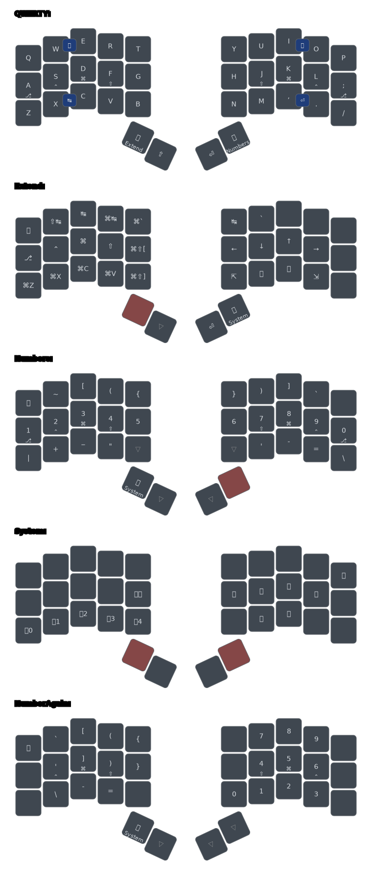

# mpa's zmk-config

This is my personal [ZMK firmware](https://github.com/zmkfirmware/zmk/) configuration.

Using my own [fork](https://github.com/mpabegg/zmk) of ZMK with the following PRs merged:
 - [#1366](https://github.com/zmkfirmware/zmk/pull/1366) feat(behaviors): Swapper implementation

