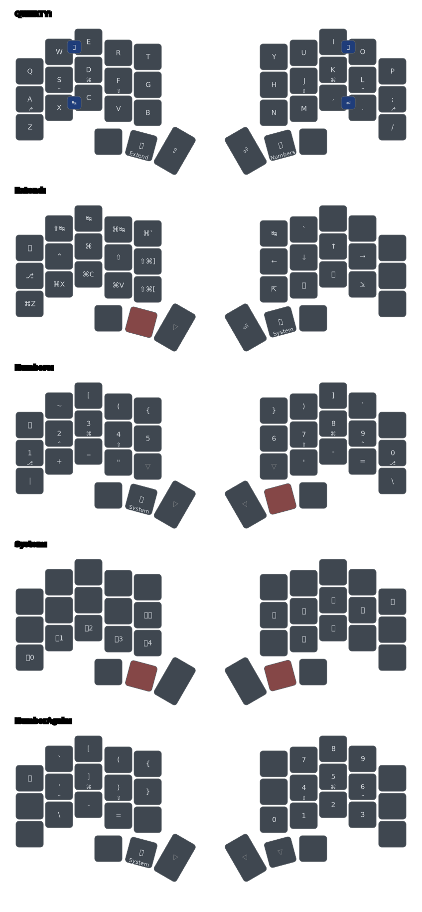

# mpa's zmk-config

This is my personal [ZMK firmware](https://github.com/zmkfirmware/zmk/) configuration.

I forked it from [urob](https://github.com/urob/zmk-config) and made some changes to suit my needs.
I'm using my own fork of the ZMK firmware, in which I have meged the Chocofi definition.

